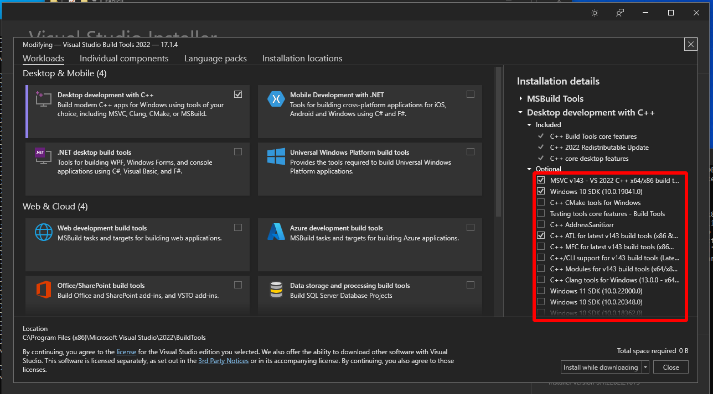
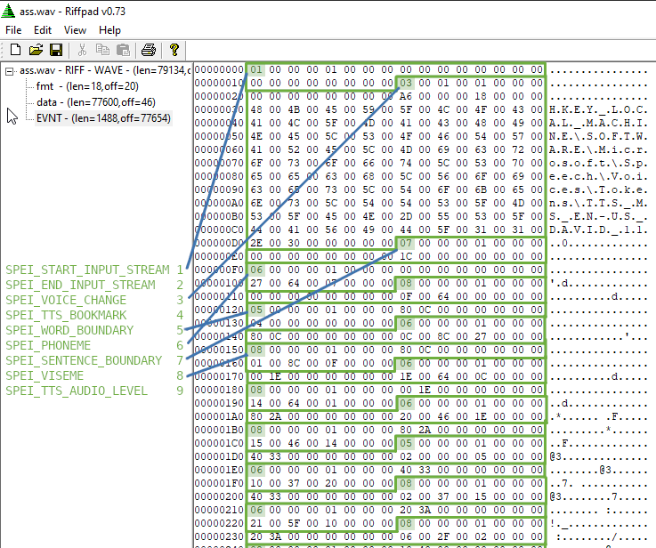

SAPI command line interface
===========================

A simple tool to generate audio from text.

Using [getoptW](https://github.com/bluebaroncanada/getoptW).

https://github.com/Essjay1/Windows-classic-samples/blob/master/Samples/Win7Samples/com/fundamentals/dcom/simple/sserver/sserver.cpp

Development process
-------------------

Microsoft can suck a big fat poopy pee pee.

Installing
----------

- Install [Visual Studio Build Tools](https://visualstudio.microsoft.com/downloads/?q=build+tools#build-tools-for-visual-studio-2022) ([direct download](https://aka.ms/vs/17/release/vs_BuildTools.exe)), and click on "Desktop Development with C++", on the right make sure to check "C++ ATL for latest ...", and you can uncheck "C++ Cmake tools ...", "Testing tools ..." and "C++ AddressSanitizer", to save on space.



After installing, run "Developer Command Prompt for VS 2022" from the start menu, or just hit "Launch" in Visual Studio Installer. `cd` to the folder where you've cloned this repo, cd to `sapicli`, and type:

`msbuild sapicli.vcxproj -p:Configuration=Release`

Links
-----

* [SAPI XML Tutorial](https://docs.microsoft.com/en-us/previous-versions/windows/desktop/ms717077(v=vs.85))
* [How to list all SAPI voices](https://stackoverflow.com/questions/17675177/c-and-microsoft-sapi-5-how-to-list-all-available-voices-and-select-a-voice
)
* [SpEnumTokens examples](https://cpp.hotexamples.com/examples/-/-/SpEnumTokens/cpp-spenumtokens-function-examples.html
)
* [List attributes for voices](https://stackoverflow.com/questions/68157410/windows-speech-sapi-how-to-list-attributes-for-voices
)
* [American English Phoneme Representation](https://docs.microsoft.com/en-us/previous-versions/windows/desktop/ee431828(v=vs.85))
* [RIFFPad](https://www.menasoft.com/blog/?p=34)
* [SPEVENTENUM](https://docs.microsoft.com/en-us/previous-versions/windows/desktop/ee431845(v=vs.85))
* [SPVISEMES](https://docs.microsoft.com/en-us/previous-versions/windows/desktop/ms717289(v=vs.85))

EVNT chunk
----------

`.wav` files generated by using [`SPBindToFile()`](https://docs.microsoft.com/en-us/previous-versions/windows/desktop/ms717492(v=vs.85)) contain an EVNT chunk, which is a list of serialized events, their structure being that of [`SPSERIALIZEDEVENT`](https://docs.microsoft.com/en-us/previous-versions/windows/desktop/ee125137(v=vs.85)) plus any string referenced inside the event itself.

The first byte is the event type, and most events are 24 bytes long. Strings that follow events are in wide char format. String lengths are padded upwards to multiples of 4. So if the string is 126 bytes, it is stored as 128 bytes, with the last two bytes beign zeroes.



Excerpt from `sphelper.h`:

```cpp
/****************************************************************************
* SpSerializedEventSize *
*-----------------------*
*   Description:
*       Returns the size, in bytes, used by a serialized event.  The caller can
*   pass a pointer to either a SPSERIAILZEDEVENT or SPSERIALIZEDEVENT64 structure.
*
*   Returns:
*       Number of bytes used by serizlied event
*
*****************************************************************************/

template <class T>
inline ULONG SpSerializedEventSize(const T * pSerEvent)
{
    ULONG ulSize = sizeof(T);

    if( ( pSerEvent->elParamType == SPET_LPARAM_IS_POINTER ) && pSerEvent->SerializedlParam )
    {
        ulSize += ULONG(pSerEvent->SerializedwParam);
    }
    else if ((pSerEvent->elParamType == SPET_LPARAM_IS_STRING || pSerEvent->elParamType == SPET_LPARAM_IS_TOKEN) &&
             pSerEvent->SerializedlParam != NULL)
    {
        ulSize += ((ULONG)wcslen((WCHAR*)(pSerEvent + 1)) + 1) * sizeof( WCHAR );
    }
    // Round up to nearest DWORD
    ulSize += 3;
    ulSize -= ulSize % 4;
    return ulSize;
}
```
